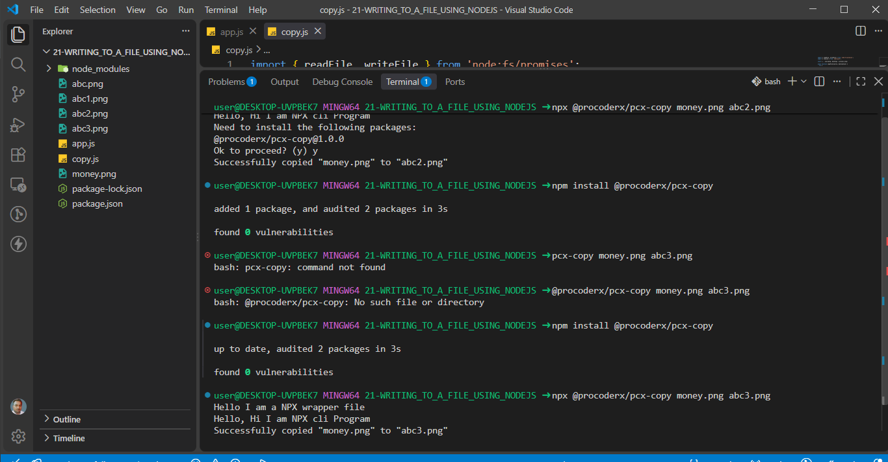
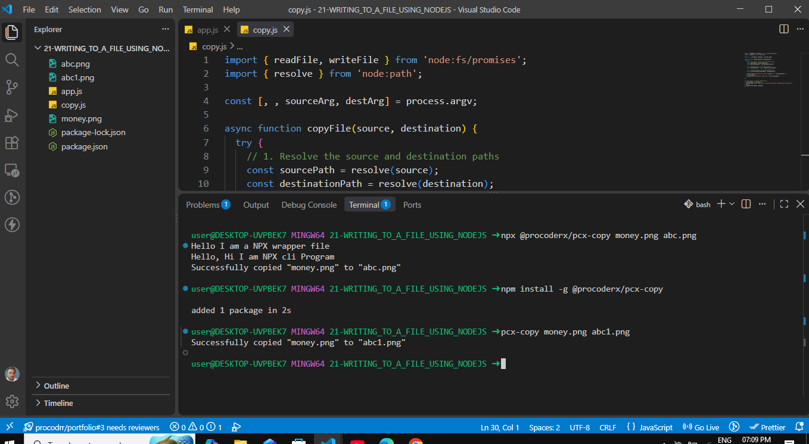

# @procoderx/pcx-copy

> A lightweight Node.js CLI utility for copying files from one location to another.

[](https://www.npmjs.com/package/@procoderx/pcx-copy)
[](https://www.npmjs.com/package/@procoderx/pcx-copy)
[](https://www.npmjs.com/package/@procoderx/pcx-copy)

---

## Overview

`@procoderx/pcx-copy` is a simple command-line utility for copying files using Node.js.

It provides a focused CLI interface for copying files without requiring a custom script or additional configuration.

```bash
pcx-copy <source-file> <destination-file>
```

---

## Features

- Copy files directly from the terminal
- Supports relative and absolute paths
- Supports text and binary files
- Uses asynchronous Node.js file-system APIs
- Built with modern ES Modules
- Provides CLI argument validation
- Displays clear error messages
- Returns appropriate process exit codes
- Supports global installation
- Supports `npx` execution
- Separates CLI handling from core file-copy logic

---

## Requirements

- Node.js `18+`
- npm `9+`

Check your installed versions:

```bash
node -v
npm -v
```

---

## Quick Start

### Using npx

No global installation required:

```bash
npx @procoderx/pcx-copy ./source.txt ./destination.txt
```

### Using the global CLI

Install the package:

```bash
npm install -g @procoderx/pcx-copy
```

Then run:

```bash
pcx-copy ./source.txt ./destination.txt
```

---

## Installation

### Global Installation

```bash
npm install -g @procoderx/pcx-copy
```

After installation, the `pcx-copy` command is available globally.

Verify the installation:

```bash
pcx-copy
```

Output:

```text
Usage: pcx-copy <source-file> <destination-file>
```

### Local Installation

Install the package inside an existing Node.js project:

```bash
npm install @procoderx/pcx-copy
```

### Using npx

Run the CLI directly without a global installation:

```bash
npx @procoderx/pcx-copy ./source.txt ./destination.txt
```

---

## Usage

### Syntax

```bash
pcx-copy <source-file> <destination-file>
```

| Argument             | Required | Description                                  |
| -------------------- | -------- | -------------------------------------------- |
| `<source-file>`      | Yes      | Path to the source file                      |
| `<destination-file>` | Yes      | Path where the copied file should be created |

---

## Examples

### Copy a File

```bash
pcx-copy ./money.png ./buffer.png
```

Output:

```text
Successfully copied "./money.png" to "./buffer.png"
```

### Copy to Another Directory

```bash
pcx-copy ./money.png ./backup/money.png
```

### Copy Using an Absolute Path

```bash
pcx-copy ./money.png /c/Users/user/Desktop/buffer.png
```

### Run with npx

```bash
npx @procoderx/pcx-copy ./money.png ./buffer.png
```

---

## Screenshots

### npx Usage



### Global Installation



---

## Supported Files

`pcx-copy` can copy regular files such as:

- Images
- PDFs
- ZIP archives
- Documents
- Videos
- Executables
- Other binary files

The file contents are handled as raw data, allowing the CLI to work with both text and binary files.

---

## How It Works

The CLI separates command-line handling from the core file-copy operation.

```text
Terminal Command
       ↓
process.argv
       ↓
Argument Validation
       ↓
copyFile()
       ↓
readFile()
       ↓
Buffer
       ↓
writeFile()
       ↓
Destination File
```

The process is intentionally simple:

1. Read the source and destination paths from `process.argv`.
2. Validate the command-line arguments.
3. Read the source file asynchronously.
4. Handle the file contents as a `Buffer`.
5. Write the contents to the destination.
6. Report the result to the terminal.

---

## Project Structure

```text
pcx-copy/
├── bin/
│   └── pcx-copy.js
├── src/
│   └── copyFile.js
├── screenshots/
│   ├── npx-usage.png
│   └── global-installation.png
├── package.json
├── README.md
└── LICENSE
```

### `bin/pcx-copy.js`

The CLI entry point responsible for:

- Reading command-line arguments
- Validating input
- Calling the copy function
- Displaying CLI messages
- Handling process exit codes

### `src/copyFile.js`

Contains the core file-copy operation:

- Resolving file paths
- Reading the source file
- Writing the destination file
- Performing the copy operation

---

## npm CLI Configuration

The package exposes the `pcx-copy` command through the `bin` field in `package.json`.

```json
{
  "name": "@procoderx/pcx-copy",
  "type": "module",
  "bin": "./bin/pcx-copy.js"
}
```

This connects the terminal command to the CLI entry point:

```text
pcx-copy
    ↓
bin/pcx-copy.js
    ↓
Node.js
```

The CLI entry file starts with the Node.js shebang:

```js
#!/usr/bin/env node
```

This allows npm to execute the file as a command-line program.

---

## Error Handling

If required arguments are missing:

```bash
pcx-copy
```

The CLI displays:

```text
Usage: pcx-copy <source-file> <destination-file>
```

File-system errors are reported to the terminal.

Example:

```text
Failed to copy file: ENOENT: no such file or directory
```

Failed operations return a non-zero process exit code.

---

## Development

Clone the repository:

```bash
git clone https://github.com/theprocoderx/pcx-copy.git
```

Navigate into the project:

```bash
cd pcx-copy
```

Install dependencies:

```bash
npm install
```

Link the package locally:

```bash
npm link
```

Test the CLI:

```bash
pcx-copy ./source.txt ./destination.txt
```

---

## Future Improvements

Possible future improvements include:

- `--help`
- `--version`
- Overwrite confirmation
- File-existence checks
- Directory copying
- Recursive copying
- Multiple source files
- Progress indicators
- Improved error codes
- Automated tests

---

## License

This project is licensed under the **MIT License**.

---

## Author

**ProCoderX (Magan Singh)**

Building practical Node.js tools and developer-focused projects.

- **Website:** https://procoderx.com
- **GitHub:** https://github.com/theprocoderx
- **LinkedIn:** https://www.linkedin.com/in/procoderx
- **npm:** https://www.npmjs.com/~procoderx
- **Email:** [procoderxs@gmail.com](mailto:procoderxs@gmail.com)
